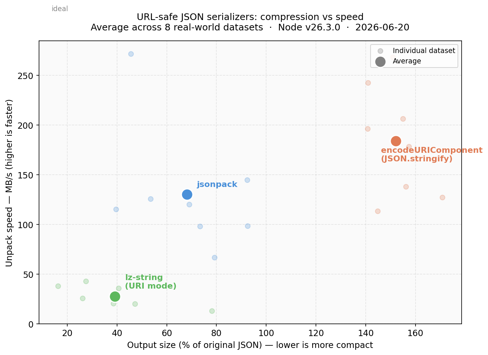
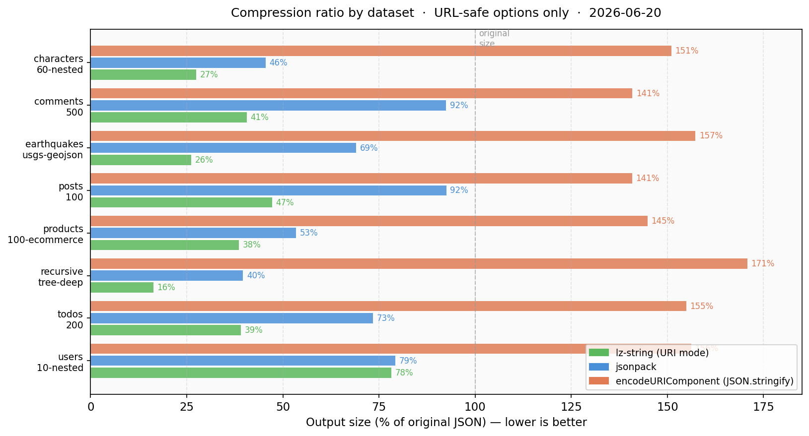
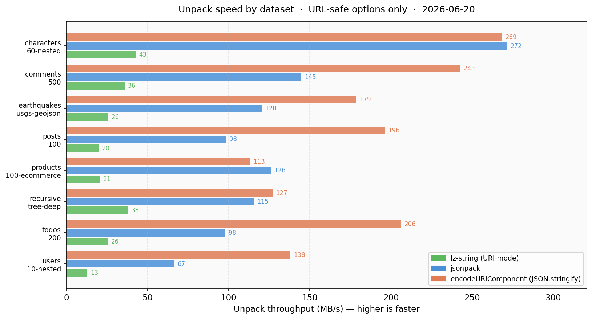

# jsonpack

[](https://github.com/rgcl/jsonpack/actions/workflows/test.yml)
[](https://www.npmjs.com/package/jsonpack)

A URL-safe JSON serializer. Produces compact ASCII output usable directly in URLs and `localStorage` — no base64, no binary, no extra encoding step.

## Installation

```bash
npm install jsonpack
```

## Usage

**CommonJS**
```js
const { pack, unpack } = require('jsonpack');
```

**ESM**
```js
import { pack, unpack } from 'jsonpack';
```

**Example**
```js
const { pack, unpack } = require('jsonpack');

const data = {
    type: 'FeatureCollection',
    features: [
        { type: 'Feature', geometry: { type: 'Point', coordinates: [-73.98, 40.74] }, properties: { name: 'A' } },
        { type: 'Feature', geometry: { type: 'Point', coordinates: [-73.99, 40.75] }, properties: { name: 'B' } },
        // ... hundreds more
    ]
};

const packed = pack(data);
// repeated keys like "type", "Feature", "geometry", "Point", "coordinates"
// are stored once in a dictionary and referenced by index

const restored = unpack(packed);
```

## API

### `pack(json, options?)`

Serializes a JSON value into a compact URL-safe string.

- `json` — any JSON-serializable value, or a JSON string
- `options.verbose` — log each step to console (default: `false`)
- `options.debug` — return internal representation instead of string (default: `false`)

`Date` objects are automatically converted to ISO 8601 strings.

Returns a `string`.

### `unpack(packed, options?)`

Restores the original value from a packed string.

- `packed` — string produced by `pack()`
- `options.verbose` — log each step to console (default: `false`)

Returns the original value.

---

## Why jsonpack

The standard way to embed JSON in a URL or `localStorage` is:

```js
encodeURIComponent(JSON.stringify(data))
```

It works, but it *expands* your data — `{`, `"`, `:` become `%7B`, `%22`, `%3A`. A typical API response grows to **140–170% of its original size**.

The alternative with the best compression, [lz-string](https://github.com/pieroxy/lz-string), shrinks data dramatically but decodes **4–6× slower**.

jsonpack sits in between: **< 7 KB minified, zero dependencies** (no transitive dependencies either).

### Benchmark

Measured across 8 real-world datasets (GeoJSON, e-commerce, API responses, deeply nested structures):



| | encodeURI(JSON) | **jsonpack** | lz-string (URI) |
|---|:---:|:---:|:---:|
| Avg output size | 152% of original | **68% of original** | 39% of original |
| Avg unpack speed | 262 MB/s | **171 MB/s** | 41 MB/s |
| Zero dependencies | ✓ | ✓ | ✓ |
| URL-safe output | ✓ | ✓ | ✓ |

#### Compression by dataset



#### Unpack speed by dataset



Full benchmark methodology and raw results: [rgcl/jsonpack-benchmark](https://github.com/rgcl/jsonpack-benchmark)

### When to use jsonpack

**Use jsonpack when:**
- You need to store JSON in a URL query string or `localStorage`
- Output size matters (jsonpack produces ~55% less data than `encodeURIComponent`)
- Fast decoding matters (jsonpack decodes 4× faster than lz-string)
- You can't afford to grow your bundle

**Use lz-string instead when** output size is the only constraint and decoding speed doesn't matter.

**Use `encodeURIComponent` when** the data is small, changes rarely, or you want zero abstraction.

### How it works

jsonpack builds a dictionary of all unique values (strings, integers, floats) in the JSON and replaces them with base-36 indices. The result is a flat, ASCII-only string. Repeated keys and values — common in structured data like API responses and GeoJSON — are stored once and referenced everywhere.

---

## Notes

- Pack and unpack are synchronous. For large payloads in a browser, run them in a [Web Worker](https://developer.mozilla.org/en-US/docs/Web/API/Web_Workers_API).
- Requires Node.js ≥ 14.
- The packed format is not binary-compatible with other JSON compression libraries.

## Licence

MIT © 2013 Rodrigo González, SASUD
